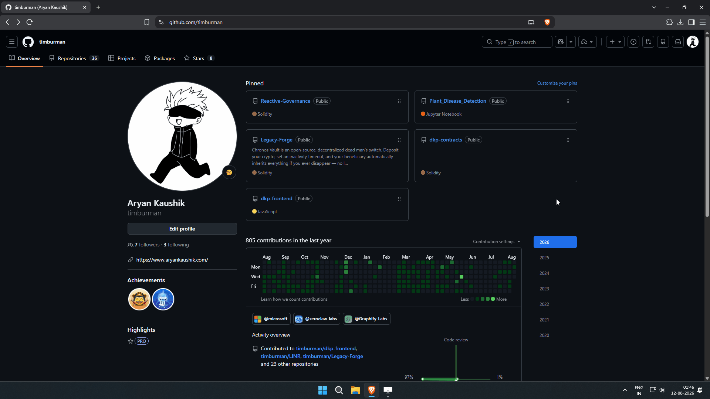
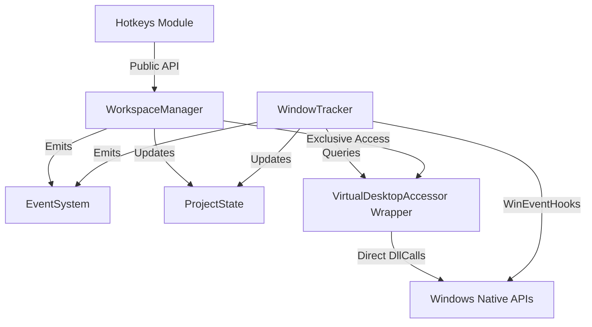

# Spacr

A fast, keyboard-driven workspace management layer for Windows virtual desktops — inspired by Hyprland, built natively for Windows.

[](https://microsoft.com/windows)
[](https://www.autohotkey.com/)
[](LICENSE)
[]()

---

## Overview

**Spacr** enhances the native Windows virtual desktop experience. It provides a fast, keyboard-driven workspace workflow while remaining completely compatible with the native Windows ecosystem.

Spacr is **not**:
- A shell replacement
- A desktop environment
- A custom compositor
- Another FancyZones clone

Instead of overriding or replacing Windows components, Spacr integrates with native Windows APIs and virtual desktop infrastructure to deliver a predictable, reliable workspace workflow.

---

## Demonstration



---

## Features (v0.2)

- **Instant Workspace Navigation**: Switch between virtual desktops cleanly using keybindings.
- **On-Demand Workspace Provisioning**: Target a workspace that does not exist yet (e.g., Workspace 7), and Spacr automatically creates intermediate desktops on the fly before switching.
- **Window Relocation**: Send the currently active window to any workspace without losing focus or context.
- **Move and Follow**: Relocate a window to a target workspace and immediately follow it.
- **Previous Workspace Toggle**: Toggle instantly between your active and previous workspace.
- **Zero-Latency Window Tracking**: Actively listens to native Windows Events (Create, Destroy, Show, Hide, Foreground) to maintain an accurate internal representation of all windows.
- **Centralized State Engine**: An in-memory state model tracking workspaces and their contained windows in real-time, completely decoupled from native Windows quirks.
- **Centralized Focus Stabilization**: Centralized Explorer focus workaround eliminates taskbar flashing and focus glitches during desktop switching.
- **TOML Configuration**: Fully configurable workspace counts, modifier keys, and behaviors via a simple `config.toml` file.

---

## Keybindings

Default keybindings use the <kbd>Alt</kbd> modifier. Keybindings can be customized in `config.toml`.

| Shortcut | Action |
| :--- | :--- |
| <kbd>Alt</kbd> + <kbd>1</kbd> .. <kbd>9</kbd> | Switch to Workspace 1–9 |
| <kbd>Alt</kbd> + <kbd>Shift</kbd> + <kbd>1</kbd> .. <kbd>9</kbd> | Move active window to Workspace 1–9 |
| <kbd>Alt</kbd> + <kbd>`</kbd> | Toggle between current and previous workspace |

---

## Configuration

Spacr uses TOML for configuration. The configuration file `config.toml` is loaded automatically from the application directory on startup.

```toml
# Spacr Configuration File (Phase 1)

workspace_count = 9
modifier = "Alt"            # Primary modifier (Options: "Alt", "Ctrl")
move_modifier = "Shift"       # Secondary modifier for window movement
follow_after_move = true    # Automatically switch workspace when moving a window
```

---

## Architecture

Spacr follows strict modularity and single-responsibility principles. Modules interact strictly through defined public APIs.



### Ownership Rules
- **WorkspaceManager**: Coordinates workspace switching and delegates to VDA.
- **WindowTracker**: Solely responsible for tracking window lifecycles and visibility via low-level native hooks.
- **ProjectState**: The single source of truth for workspaces, focused windows, and window metadata.
- **Hotkeys**: Handles global keybindings and delegates 100% of actions to `WorkspaceManager` public methods.
- **VDA**: Wraps C++ DLL function calls into clean, error-handled methods.
- **Config**: Reads and parses `config.toml` with safe default fallbacks.

---

## Engineering Philosophy

Spacr development strictly prioritizes:

1. **Stability**
2. **Correctness**
3. **Simplicity**
4. **Maintainability**
5. **Modularity**
6. **Performance**

Every architectural decision is made to keep Spacr predictable, lightweight, and easily maintainable.

---

## Quick Start

### Requirements
- **Windows 10** or **Windows 11**
- **[AutoHotkey v2.0+](https://www.autohotkey.com/)**

### Running Spacr
1. Clone the repository:
   ```powershell
   git clone https://github.com/timburman/Spacr.git
   cd Spacr
   ```
2. Launch `main.ahk`:
   ```powershell
   & "C:\Program Files\AutoHotkey\v2\AutoHotkey64.exe" main.ahk
   ```
   *or double-click `main.ahk` in File Explorer.*

---

## Roadmap

- [x] **v0.1-alpha**: Core Workspace Manager, TOML Configuration, VDA Integration, Explorer Focus Workaround.
- [x] **v0.2-alpha**: Window Tracking & Internal State System.
- [ ] **v0.3-alpha**: Dynamic Tiling Engine (BSP / Master-Stack Layouts).
- [ ] **v0.4-alpha**: Layout System & Native Window Renderer.

---

## Contributing

Contributions are welcome! Please see [CONTRIBUTING.md](CONTRIBUTING.md) for architectural guidelines, code standards, and PR instructions.

---

## License

This project is licensed under the MIT License. See the [LICENSE](LICENSE) file for details.
